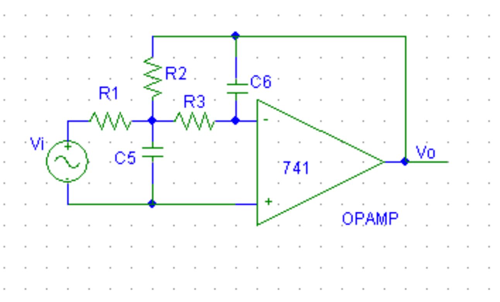

# Butterworth circuit values

 MATLAB functions for calculating circuit values for 4th order Butterworth filter consisting of two Rauch filters in series.

 

 First choose a C5 value for each Rauch filter.

 Then calculate m value upper limits with your desired values of shaping parameter Q and voltage gain G. For a butterworth filter the Q values must be 0.541 and 1.307 respectively. The G values must multiply together to give the desired overall passband small-signal voltage gain.

 ```matlab
 m_a = m(0.541, 1)
 m_b = m(1.307, 100)
 ```

 In this case a passband small-signal voltage gain of 100 (40dB) is required so the two gain values are chosen as 1 and 100.

 The next step is to choose a value of m for each filter from the upper limits calculated.

 The last step is to plot a Bode plot of the filter. This will also print out values for each passive component in each filter as well as its individual transfer function.

 ```matlab
 bode(H(C5_a, C5_b, G_a, G_b, m_a, m_b));
 ```

replacing the arguments with the chosen ones.
